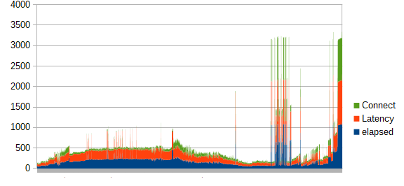

- # Introduction
  
	- ## Purpose
		- The test summary report, also known as a Test Closure Report, provides stakeholders with a condensed account of the overall test results, defects and connected data following a test project. It will also provide stakeholders with insight on how the quality assurance engineers ensured compliance of the product to Functional, Product and Business Requirements.
	- ## Glossary
	  
		- <ins>Test Pyramid</ins>
		  
			- **Unit Testing:** This software testing basic approach  is followed by the programmer to test the unit of the program. It helps  developers to know whether the individual unit of the code is working properly or not.
			- **Integration testing:** It focuses on the construction and design of the software. You need to see that the integrated units 
			  are working without errors or not.
			- **System testing:** In this method, your software is compiled as a whole and then tested as a whole. This testing strategy  checks the functionality, security, portability, amongst others.
			- {:height 350, :width 616}
            - 
		- <ins>Regression Testing</ins>
			- is defined as a type of software testing to confirm that a recent program or code change has not  adversely affected existing features. Regression Testing is nothing but a full or partial selection of already executed test cases that are  re-executed to ensure existing functionalities work fine.
		- <ins>Test Environment</ins>
			- is a setup of software and hardware for the testing teams to execute test cases. In other words, it supports test execution with hardware, software and network configured.
		- <ins>Test Estimation</ins>
			- is a management activity which approximates **how long** a Task would take to complete. Estimating effort for the test is one of the **major** and **important** tasks in Test Management.
		- <ins>Test Strategy</ins>
			- is a plan for defining an approach to the Software Testing Life Cycle (STLC). It guides QA teams to define [ Test Coverage ](https://www.guru99.com/test-coverage-in-software-testing.html) and testing scope.
		- <ins>Test Coverage</ins>
			- is defined as a metric in Software Testing that measures the amount of testing performed by a set of test. It will include gathering information about which parts of a program are executed when running the test suite to determine which branches of conditional statements have been taken.
		- <ins>Unit Testing</ins>
			- is a software testing 
			  method by which individual units of source code—sets of one or more 
			  computer program modules together with associated control data, usage 
			  procedures, and operating procedures—are tested to determine whether 
			  they are fit for use.
		- <ins>Functional Testing</ins>
			- is the testing of all the required functions of the product, defined in Functional Requirements document.
		- <ins>Non-Functional Testing (sometimes simplified to "performance testing")</ins>
			- is the testing of all of the other success factors of the product that are not defined in the technical requirements.
			- <ins>Load Test</ins>
				- Load Testing is performed to test the performance of the system or software application under extreme load.
				- => in a load test, the load limit is the threshold of a break.
			- <ins>Stress Test</ins>
				- Stress Testing is performed to test the robustness of the system or software application under extreme load.
				- => in a stress test, the testing load limit is above the threshold of a break.
			- <ins>Spike Test</ins>
				- Spike Testing is mostly a stress test over a very short amount of time. (sudden peak)
			- <ins>Soak Test</ins>
				- Soak Testing is both load and stress testing since it allows to monitor both performance and robustness of an app under heavy load, specifically over large amounts of time.
	- ## Points of Contact
	  
		- If you have any inquiries about the quality management, or any aspect of the product, please contact one of our team representatives:
		- |Name|Role|Preferred communication method|
		  |--|--|--|
		  |Mathis KAKAL|Quality Assurance Manager/Engineer|mail: mathis.kakal@algosup.com|
		  |Leo CHARTIER|Project Manager|mail: leo.chartier@algosup.com|
		  |Mathieu CHAPUT|Tech Lead|mail: mathieu.chaput@algosup.com|
- # Test Plan

    - ## Requirement Analysis

        - ### Who will use the product ?
            
            - The product is destined to everyone interested in either visiting the website, or discovering when/if santa will come at their place, and that has the capacity of connecting to it via a web browser.

        - ### What is it used for ?
            
            - As described above and in the Functional Requirements Document (FRD), the website serves a double purpose, it will attract users thanks to its entertaining function with the underlying goal of proving its resilience, scalability and elasticity as a self-scaling containerized web application (a website, to be specific). Most of the functions described and tested represent the front end of the project, but an emphasis should be put on the load/scaling mechanism (back end), since it is really what interests the client.

        - ### How will it work ?
            
            - Users will connect to the website via a web browser to land on page where small interactions (questions) will be required from them before they are asked to enter their/any address. Based on the address/their answers, either gifts will be displayed, with a countdown to Santa's arrival, or coal, indicating that the user does not deserve a gift. The identified goals are:
                - to generate traffic on the customer's domain (Algosup.com)
                - to demonstrate the scaling capacity of the product.
            - Therefore, in order to retain users, and capitalize on word to mouth the sharing experience of the website is of high priority too.
            
        - ### What software/hardware will it use ?
            
            - #### Software
                
                - <ins>For the server</ins>
                    - The technology stack consists of a docker container based on a linux alpine base image on Azure, with extras installed:
                        - npm
                        - nodejs
                        - express
                        - suncalc
                        - path
                    - Additionally Kubernetes is used through AKS (Azure Kubernetes Services)
                    - Photon as a geocoder and as an Open Street Maps Database provider, hosted on a separate Azure Database VM
                        - The Database is based on postgis which is a geolocation based addon for postgres databases.
                        - Photon's search is based on elasticsearch and features typo tolerance, location bias and various performance and scalability features.
                    - As mentioned, everything is set up on Azure with tight budget limitations (zero budget), therefore limiting us on our demonstration, performance and especially monitoring capabilities, since producing logs from Azure is very expensive compared to even hosting the website for a few weeks, which can be costless. This however pushed us to be more efficient with our resources as much as system nonetheless.
                    - The risk was that monitoring has to be done on the same Azure instance as the servers and databases, consuming the same credit as them, therefore jeopardizing its operation.
                    - In order to maximize the use of free credits, we will limit the monitoring of the website to the last two weeks of the project, and focus mainly on client side functional and performance testing.
                    - Various Azure SaaS were used, including:
                        - Azure Pricing Calculator: for estimating and making compromises for the project
                        - Azure Container Registry: for hosting our docker images
                        - Helm: for installing kubernetes packages
                        - Azure CLI: for managing Azure
                        - Azure Load Testing: For initial load tests
                - <ins>For the client</ins>
                    - Desktop:
                        - Web Browsers (coverage 87,58%):
                            *source: https://gs.statcounter.com/*
                            *test versions are defined in the environment set up*
                            - Chrome (latest stable): 65,84%
                            - Safari (latest stable): 18,7%
                            - Firefox (latest stable): 3,04%
                    - Mobile:
                        - Web Browsers (coverage 90.38%)
                            *source: https://gs.statcounter.com/*
                            *test versions are defined in the environment set up*
                            - Chrome (latest stable): 66.23%
                            - Safari (latest stable): 24,15%

			- #### Hardware
			  
				- <ins>For the server</ins>
					- Specs:
						- |Name|Standard_DS2_v2|
						  |--|--|
						  |Details|Standard tier, for general purpose compute; can use premium storage and offers local SSD disk cache; VM size of 2; Hyper-V gen 2|
						  |vCPUs|2|
						  |CPU Architecture|x64|
						  |Memory|7GiB|
						  |Hyper-V Generation|v1, v2|
						  |Azure Compute Units|210|
						  |Performance Score|37635|
						  |Processor|Intel Xeon CPU E5-2673 v3 @240GHz|
						  |NUMA Nodes|1|
						  |Max Network Interfaces|2|
						  |RDMA Enabled|No|
						  |Accelerated Networking|Yes|
						  |OS disks size|1023GiB|
						  |Resource (temporary) disk size|14GiB|
						  |Max Disks|8|
						  |Support Premium Disks|Yes|
						  |Combine IO/s|8000|
						  |Uncached IO/s|6400|
						  |Combined Write|64 MiB/s|
						  |Combined Read|64 MiB/s|
				- <ins>For the Client (Minimal Recommended Specs to run the Project)</ins>
					- 8gb RAM
					- Windows 11 (10.0.22000.778) or OS X Monterey 12.6

		- ### Conclusion
		  
			- As presented above and in the functional requirements document, the testing will occur on functional factors as well as non-functional factors that will guarantee the success its compliance with the Functional Specifications.

	- ## Test Strategy
	  
		- ### Goals
		  
			- In order to improve the quality of the product, we must first define the key performance indicators that is of interest for all parties (customer, end user, product team).
			- For the end user, the following widely accepted and scientifically proven front-end guidelines will be set as an objective, including:
				- The site should load in under 2s for at least 9/10 page loads
				- If the site takes more than that, it must not go above 4 seconds, as 50%-60% of users exit the page at that point (after 10 seconds it is almost 100%)
				- The previous should be true for up to 10 000 concurrent, organic users
			- Additionally, we will use Google's Lighthouse page insights to provide good SEO compliance and user experience. The rules are:
				- **[Largest Contentful Paint (LCP)](https://web.dev/lcp/)**: measures *loading* performance. To provide a good user experience, LCP should occur within **2.5 seconds** of when the page first starts loading.
				- **[First Input Delay (FID)](https://web.dev/fid/)**: measures *interactivity*. To provide a good user experience, pages should have a FID of **100 milliseconds** or less.
				- **[Cumulative Layout Shift (CLS)](https://web.dev/cls/)**: measures *visual stability*. To provide a good user experience, pages should maintain a CLS of **0.1.** or less.
				- {:height 202, :width 674}
			- Therefore the main KPIs will be the page loading times and the number of concurrent users
			- It goes without saying that the goal of the quality assurance engineering that will be done is also to ensure that the product if bug free upon release.

		- ### Efforts & Costs
		  
			- As this is done as a demo project, and since the budget is null, it is important to remember that Azure makes it expensive to log data over time, which greatly limits our journaling and monitoring potential.
			- A single quality assurance engineer is allocated to the task, and will be in charge of both planning, testing, maintaining and documentation.
			- The testing phases will begin once the first release of the product is  published by the development team.
				- *Extract from the project's management timeline:*
					- 
					- This leaves us with a 22 days testing period until final release on the 13th of December

		- ### Scope
		  
			- #### In Scope
			  
				- Testing will cover the entirety the internal functions listed in the functional Requirements Document (Functional Testing) to ensure meeting the business requirements.
				- Then, non-functional factors such as performance, reliability, scalability and security — among others — will be tested as well.
				- It will be tested for Accessibility as well.

			- #### Out of Scope
			  
				- Since the developer is in charge of test driven development and unit tests, those will not be included in this document.
				- All third party services such as Social media sharing options which do not depend on the development team
				- Maintenance testing, since there is no continuous integration/delivery to be expected past the delivery date
				- Optimization of Container orchestration, since Kubernetes is managed by Azure Kubernetes Cluster.
				- Testing the hardware for failures, is impossible for obvious reasons, since our physical resources aren't exclusive to us.

		- ### Test Types
		  
			- DONE Considering the functional analysis of the product, we can anticipate that the following components will be tested with the following methodology:
			  
				- {:height 217, :width 893}
				- *NB: The code and Unit Testing are to be performed by the developer, while sanity testing should be performed in the CI/CD pipeline, after each functional change*
				- We can also split our tests into three main categories:
				- |Front End|Data/Back End|Non-Functional|
				  |--|--|--|
				  |Unit (non applicable), integration, sanity (when applicable), smoke and functional tests to validate all the business requirements|Unit (non applicable), integration, sanity (when applicable), smoke and functional tests to validate all the business requirements|Performance (Load, Stress, Endurance, Spike, Volume, Scale tests), Security|
				- Finally, we will add that our tests will be performed either automatically, or manually.
- # Testing

	- ## Test Coverage overview

		- {:height 495, :width 598}

	- ## Test Requirements Traceability Matrix
	  
		- <ins>Functional Tests Table:</ins>
			- |  U.C.# | Function Number | Description | Test Number (FT = Functional Test, NFT = Non Functional/Performance Test) | Test Types |
			  |---|---|---|---|---|
			  | 1 | F1 | Animation Loads | FT1 | Functional (UI) Test |
			  | 1 | F2 | User Answers simple questions | FT1 | Functional (UI) Test |
			  | 1 | F3 | User enters Address | FT1 | Functional (UI) Test |
			  | 1 | F4 | DB is queried and answers possible matches | FT1, NFT1 | Functional Test; Performance Test; Security Test |
			  | 1 | F5 | App selects first match | Not Applicable | Unit Test |
			  | 1 | F6 | Coordinates are extracted for this result | Not Applicable | Unit Test |
			  | 1 | F7 | coordinates converted to nadir | Not Applicable | Unit Test |
			  | 1 | F8 | Countdown or charcoal is displayed | FT1 | Functional (UI) Test |
			  | 2 | F9 | User clicks on social share buttons | FT2 | Functional (UI) Test |
			  | 2 | F10 | Copy to clipboard | FT2 | Functional Test |
			  | 2 | F11 | Open requested site with template message | FT2 | Functional (UI) Test |
			  | 3 | F12 | User clicks on Christmas tree ball | FT3 | Functional (UI) Test |
			  | 3 | F13 | Desired project loads | FT3 | Functional (UI) Test |
			  | 4 | F14 | User clears field by clicking on it | FT4 | Functional (UI) Test |
			  | 4 | F15 | User enters a new address | FT4 | Functional (UI) Test |
			  | 4 | F16 | Load cached result | FT4; NFT2 | Functional (UI) Test; Performance Test |
			  | 5 | F17 | User clicks on github link | FT5 | Functional (UI) Test |
			  | 5 | F18 | Github page is loaded | FT5 | Functional (UI) Test |
			  | 6 | F19 | User clicks on ALGOSUP link | FT6 | Functional (UI) Test |
			  | 6 | F20 | ALGOSUP page is loaded | FT6 | Functional (UI) Test |
			  | 7 | F21 | User clicks on contact button | FT7 | Functional (UI) Test |
			  | 7 | F22 | Contact is revealed | FT7 | Functional (UI) Test |
			  | 7 | F23 | Clicking on it opens default mail app | FT7 | Functional (UI) Test |
			  | 8 | F24 | Cookie popup appears | FT8 | Functional (UI) Test |
			  | 8 | F25 | Cookie uses and vendors are fetched | FT8 | Functional Test |
			  | 8 | F26 | User sets their preference | FT8 | Functional Test; Functional (UI) Test |
			  | 8 | F27 | Preferences are saved & settings updated | FT8 | Functional Test; Functional (UI) Test |
			  | 8 | F28 | Confirmation message | FT8 | Functional (UI) Test |
			  | 9 | F29 | Cookie Popup appears  | FT9 | Functional (UI) Test |
			  | 9 | F30 | User clicks on the privacy policy link in the cookie popup | FT9 | Functional (UI) Test |
			  | 9 | F31 | The privacy policy page is displayed | FT9 | Functional (UI) Test |
		- We have also planned a series of Non-Functional tests which include but are not limited to:
			- Load Tests
				- Spike Tests
				- Soak Tests
			- Accessibility
			- Law Compliance
			- Security
            
	- ## Test Cases
	  
		- ### FT1:
			- | TESTS | SUB TESTS                               | TEST CASES                     | EXIT CRITERIA             | ENVIRONMENTS                                                      |
			  | ----- | --------------------------------------- | ------------------------------ | ------------------------- | ----------------------------------------------------------------- |
			  | FT1.1 | has animation loaded? in how much time? | No parameters                  | passed if under 2 seconds | Mobile/Tablet(Safari & Chromium); Desktop (Chrome, Edge, Firefox) |
			  | FT1.2 | Have the questions been asked?          | No parameters                  | passed if yes             | Mobile/Tablet(Safari & Chromium); Desktop (Chrome, Edge, Firefox) |
			  | FT1.3 | Does the search field work?             | Random search from search file | passed if yes             | Mobile/Tablet(Safari & Chromium); Desktop (Chrome, Edge, Firefox) |
			  | FT1.4 | Dos the countdown display correctly?    | No parameters                  | passed if yes (two cases) | Mobile/Tablet(Safari & Chromium); Desktop (Chrome, Edge, Firefox) |
		- ### FT2:
			- | TESTS   | SUB TESTS                               | TEST CASES                           | EXIT CRITERIA                     | ENVIRONMENTS                                                      |
			  | ------- | --------------------------------------- | ------------------------------------ | --------------------------------- | ----------------------------------------------------------------- |
			  | FT2.1   | Does the button do the required action? |                                      |                                   |                                                                   |
			  | FT2.1.1 |                                         | Clipboard if Copy Link               | passed if yes                     | Mobile/Tablet(Safari & Chromium); Desktop (Chrome, Edge, Firefox) |
			  | FT2.1.2 |                                         | Template social post if social media | passed if opened tab (incomplete) | Mobile/Tablet(Safari & Chromium); Desktop (Chrome, Edge, Firefox) |
		- ### FT3:
			- | TESTS   | SUB TESTS                               | TEST CASES             | EXIT CRITERIA                     | ENVIRONMENTS                                                      |
			  | ------- | --------------------------------------- | ---------------------- | --------------------------------- | ----------------------------------------------------------------- |
			  | FT3.1   | Does the button do the required action? |                        |                                   |                                                                   |
			  | FT3.1.1 |                                         | for Group 8's project. | passed if opened tab (incomplete) | Mobile/Tablet(Safari & Chromium); Desktop (Chrome, Edge, Firefox) |
			  | FT3.1.2 |                                         | for Group 6's project. | passed if opened tab (incomplete) | Mobile/Tablet(Safari & Chromium); Desktop (Chrome, Edge, Firefox) |
			  | FT3.1.3 |                                         | for Group 5's project. | passed if opened tab (incomplete) | Mobile/Tablet(Safari & Chromium); Desktop (Chrome, Edge, Firefox) |
		- ### FT4:
			- | TESTS   | SUB TESTS                   | TEST CASES                                                 | EXIT CRITERIA | ENVIRONMENTS                                                      |
			  | ------- | --------------------------- | ---------------------------------------------------------- | ------------- | ----------------------------------------------------------------- |
			  | FT4.1   | Is field cleared on click?  |                                                            | passed if yes | Mobile/Tablet(Safari & Chromium); Desktop (Chrome, Edge, Firefox) |
			  | FT4.2   | Does the search field work? |                                                            |               |                                                                   |
			  | FT4.2.1 |                             | sample request (has to be different)                       | passed if yes | Mobile/Tablet(Safari & Chromium); Desktop (Chrome, Edge, Firefox) |
			  | FT4.2.2 |                             | sample request (has to be same as previous to try caching) | passed if yes | Mobile/Tablet(Safari & Chromium); Desktop (Chrome, Edge, Firefox) |
		- ### FT5:
			- | TESTS | SUB TESTS                                        | TEST CASES    | EXIT CRITERIA | ENVIRONMENTS                                                      |
			  | ----- | ------------------------------------------------ | ------------- | ------------- | ----------------------------------------------------------------- |
			  | FT5   | Does the button do the required action? (Github) | No parameters | passed if yes | Mobile/Tablet(Safari & Chromium); Desktop (Chrome, Edge, Firefox) |
		- ### FT6:
			- | TESTS | SUB TESTS                                         | TEST CASES    | EXIT CRITERIA | ENVIRONMENTS                                                      |
			  | ----- | ------------------------------------------------- | ------------- | ------------- | ----------------------------------------------------------------- |
			  | FT6   | Does the button do the required action? (ALGOSUP) | No parameters | passed if yes | Mobile/Tablet(Safari & Chromium); Desktop (Chrome, Edge, Firefox) |
		- ### FT7:
			- | TESTS | SUB TESTS                | TEST CASES    | EXIT CRITERIA | ENVIRONMENTS                                                      |
			  | ----- | ------------------------ | ------------- | ------------- | ----------------------------------------------------------------- |
			  | FT7.1 | Is contact revealed ?    | No parameters | passed if yes | Mobile/Tablet(Safari & Chromium); Desktop (Chrome, Edge, Firefox) |
			  | FT7.2 | Is mailto link working ? | No parameters | passed if yes | Mobile/Tablet(Safari & Chromium); Desktop (Chrome, Edge, Firefox) |
		- ### FT8:
			- | TESTS   | SUB TESTS                                  | TEST CASES           | EXIT CRITERIA | ENVIRONMENTS                                                      |
			  | ------- | ------------------------------------------ | -------------------- | ------------- | ----------------------------------------------------------------- |
			  | FT8.1   | do cookie preferences Load up correctly ?  | No parameters        | passed if yes | Mobile/Tablet(Safari & Chromium); Desktop (Chrome, Edge, Firefox) |
			  | FT8.2   | Can the user save & exit ?                 | No parameters        | passed if yes | Mobile/Tablet(Safari & Chromium); Desktop (Chrome, Edge, Firefox) |
			  | FT8.3   | Cn the user accept ?                       | No parameters        | passed if yes | Mobile/Tablet(Safari & Chromium); Desktop (Chrome, Edge, Firefox) |
			  | FT8.4   | Are they persistent after a modification ? |                      |               |                                                                   |
			  | FT8.4.1 |                                            | After a reload       | passed if yes | Mobile/Tablet(Safari & Chromium); Desktop (Chrome, Edge, Firefox) |
			  | FT8.4.2 |                                            | After a modification | passed if yes | Mobile/Tablet(Safari & Chromium); Desktop (Chrome, Edge, Firefox) |
		- ### FT9
			- | TESTS | SUB TESTS                              | TEST CASES    | EXIT CRITERIA | ENVIRONMENTS                                                      |
			  | ----- | -------------------------------------- | ------------- | ------------- | ----------------------------------------------------------------- |
			  | FT9.1 | Can the user click on privacy policy ? | No parameters | passed if yes | Mobile/Tablet(Safari & Chromium); Desktop (Chrome, Edge, Firefox) |
			  | FT9.2 | Does the page load ?                   | No parameters | passed if yes | Mobile/Tablet(Safari & Chromium); Desktop (Chrome, Edge, Firefox) |
		- ### NFT1:
			- | TESTS                     | SUB TESTS               | TEST CASES                                                          | EXIT CRITERIA                                                       | ENVIRONMENTS |
			  | ------------------------- | ----------------------- | ------------------------------------------------------------------- | ------------------------------------------------------------------- | ------------ |
			  | NFT1.1 Geo Database Fetch | Database integrity test | During the previous tests, was data altered in some way or another? | passed if yes                                                       | Headless     |
			  | NFT1.2                    | Database Load Test      |                                                                     |                                                                     |              |
			  | NFT1.2.1                  |                         | Database Soak test                                                  | Can it withstand 20000 or more concurrent queries in 10 seconds? \* | Headless     |
			  | NFT1.2.2                  |                         | Database Spike test                                                 | Can it withstand 10 queries per second for an hour? Passed if yes   | Headless     |
			  | NFT1.3                    | Database security test  |                                                                     | passed if test suite passed                                         | Headless     |
		- ### NFT2:
			- | TESTS | SUB TESTS                  | TEST CASES | EXIT CRITERIA                                                                 | ENVIRONMENTS                                                      |
			  | ----- | -------------------------- | ---------- | ----------------------------------------------------------------------------- | ----------------------------------------------------------------- |
			  | NFT2: | Results Local Caching test |            | Does the page detect same input and provides same answer (without fetching ?) | Mobile/Tablet(Safari & Chromium); Desktop (Chrome, Edge, Firefox) |
		- ### NFT3:
			- | TESTS    | SUB TESTS        | TEST CASES        | EXIT CRITERIA                                                    | ENVIRONMENTS |
			  | -------- | ---------------- | ----------------- | ---------------------------------------------------------------- | ------------ |
			  | NFT3.1   | Server Load Test |                   |                                                                  |              |
			  | NFT3.1.1 |                  | Server Spike test | Can it withstand 20000 or more concurrent queries in 10 seconds? | Headless     |
			  | NFT3.1.2 |                  | Server Soak test  | Can it withstand 10 queries per second for an hour?              | Headless     |
		- ### NFT4:
			- | TESTS  | SUB TESTS             | TEST CASES          | EXIT CRITERIA                             | ENVIRONMENTS  |
			  | ------ | --------------------- | ------------------- | ----------------------------------------- | ------------- |
			  | NFT4.1 | Server Security tests | Input sanitization  | Does express-validate agree ? or sanitize | Headless      |
			  | NFT4.2 |                       | Github Code checker | AI tests                                  | CICD Pipeline |
		- ### NFT5:
			- | TESTS | SUB TESTS                    | TEST CASES                            | EXIT CRITERIA                                                                                                                                                                             | ENVIRONMENTS                                                      |
			  | ----- | ---------------------------- | ------------------------------------- | ----------------------------------------------------------------------------------------------------------------------------------------------------------------------------------------- | ----------------------------------------------------------------- |
			  | NFT5  | Accessibility tests (Manual) | Is it ok for visually impaired people | Header tag hierarchy ?; Proper alt text; links with descriptive names; Use daltonize me to see how it turns our with colors; don't use tables for layout; is dynamic content accessible ? | Mobile/Tablet(Safari & Chromium); Desktop (Chrome, Edge, Firefox) |
		- ### NFT6:
			- | TESTS    | SUB TESTS                 | TEST CASES       | EXIT CRITERIA                       | ENVIRONMENTS                                                      |
			  | -------- | ------------------------- | ---------------- | ----------------------------------- | ----------------------------------------------------------------- |
			  | NFT6.1   | Responsive tests (Manual) |                  |                                     |                                                                   |
			  | NFT6.1.1 |                           | Test for Mobile  | Does it render well ? passed if yes | Mobile/Tablet(Safari & Chromium); Desktop (Chrome, Edge, Firefox) |
			  | NFT6.1.2 |                           | Test for Tablet  | Does it render well ? passed if yes | Mobile/Tablet(Safari & Chromium); Desktop (Chrome, Edge, Firefox) |
			  | NFT6.1.3 |                           | Test for Desktop | Does it render well ? passed if yes | Mobile/Tablet(Safari & Chromium); Desktop (Chrome, Edge, Firefox) |
	- ## Testing Tools

		- ### Bug reporting
			- Trello
		- ### Automation
			- CI/CD with github actions
		- ### Functional UI tests
			- Performed automatically with Selenium after each time code is pushed on the branch
		- ### Accessibility & Responsive tests
			- Performed manually
			- Mobile will be simulated via screen size.
		- ### Performance testing
			- Testing with Apache JMeter
				- On the server
					- Soak test done manually once a week
					- Spike test done manually few a week
					- Stress test done automatically at each update
				- On the database
					- Soak test done manually once a week
					- Spike test done manually few a week
					- Stress test done automatically at each update
			- Additional testing with more chaotic requests
				- DDoSify
				- Ddostest.me
	- ## Setting Up Environments
	  
		- The Environments, as defined in the Test Cases will be:
			- Windows 11 Virtual Machines with either Selenium and Apache JMeter installed
			- Both desktop and mobile will be tested. (Mobile is done Manually)
			- Both the website and the database will go through Load, Spike, Soak and Stress testing
		- The tests will be run by a single Quality Assurance Engineer (myself)
		- Throughout the whole duration of the project.
- # Documenting

	- ## Testing Timeline
	  
		- Here is an overview of how the testing will be conducted in time.
		- 
	- ## Results/Report Overview
	  
		- We mainly used Trello as a bug reporting tool.
		- ### Functional (UI) Testing
			- Over the course of three weeks, from the moment the app was available online, all the website's functions have been thoroughly tested. There is not much to say here as the website is fairly simple and the vast majority of the functions are stateless. Most of the UI testing allowed to reveal responsive issues, which have since then been resolved, even though as of now, the product still requires some work on that aspect. Some other minor bugs were found and fixed.
		- ### Server testing (Soak test, Spike test with JMeter)
			- There have been noticeable improvements to the server's performance between week 3 and week 5. Prior to posterior improvements, the docker image was unoptimized and the server ran solely on a container.
				- <ins>Spike test 1 (1000 requests in 5 seconds) (most of the requests are still in a reasonable range) (response time in ms)</ins>
					- 
				- <ins>Spike test 2 (2000 requests in 5 seconds almost half of the requests induce unacceptable age loads)</ins>
					- 
			- Whereas, once kubernetes, and major improvements to the docker image and additional configuration were done (by Week 5), we get totally different results:
				- <ins>Spike test 1000 over 5 seconds (great performance)</ins>
					- 
				- <ins>Spike test 10 000 over a minute (only a very small fraction of the requests have a drop in performance)</ins>
					- 
				- <ins>Spike test 15 000 over a minute (server starting to respond predictably slow)</ins>
					- 
				- <ins>Bonus: Spike test 50 000 over 3 minutes (way out of bounds...)</ins>
					- 
		- ### Database testing (Soak test, Spike test with JMeter)
			- The database (Photon), based on elasticsearch, features some caching and location bias, making it pass with reasonable performances under stress whether it is short or long bursts. It is pretty much on par with the main server as it fulfills to provide an acceptable response time for up to 10 000 users. it even held up to 30 000 in a spike test, near the end of its development.
	- ## Release Notes
	  
		- The lack of monitoring resources and capabilities due to the costless nature of this project didn't allow us to fully assess and benchmark the server code, while Azure was handling part of the scaling itself, through AKS.
		- From the room we have left, only some minor improvements like local caching and responsive would be recommended prior to initial release.
		- With more budget, load balancing, and container health and performance monitoring with prometheus and a more end to end solution for visualizing data such as grafana would be highly recommended.